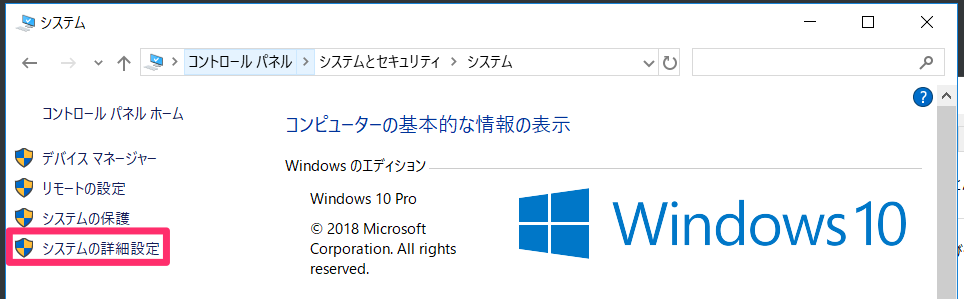
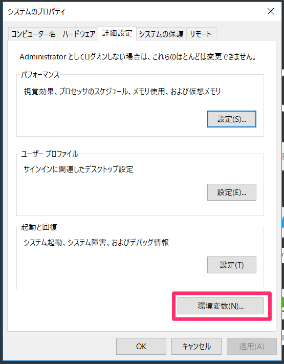
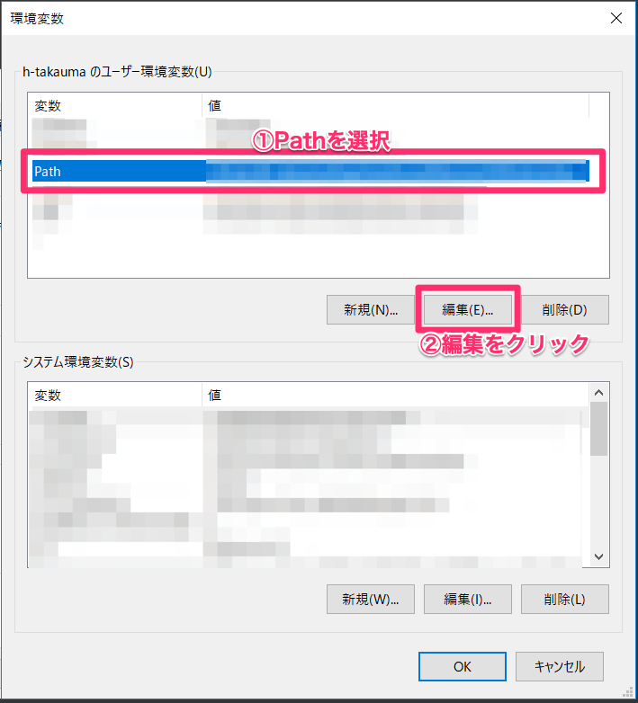
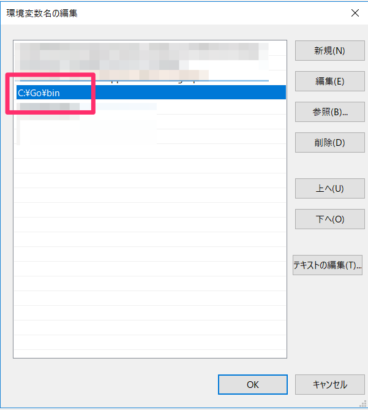
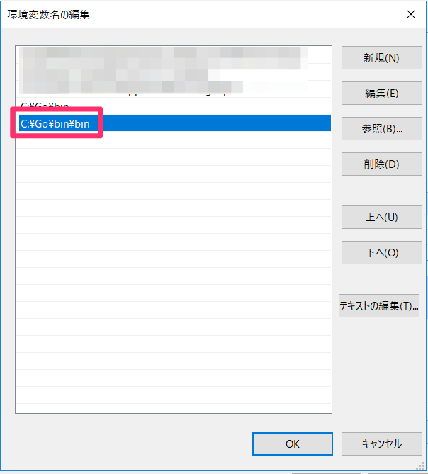

# 資料タイトル

## googlecodelabs環境構築
googlecodelabsの解説をします！

### goをインストールしよう！
Goの環境を整えます。こちらからインストールしてください。

[https://golang.org/doc/install](https://golang.org/doc/install)

### 環境変数設定（Windows編）
Windowsの方はGoの環境変数にインストールしたフォルダを指定しましょう。

コントロールパネルから［システムの詳細設定］をクリック



［環境変数］をクリック



Pathをクリックして、［編集］ボタンをクリックします。



インストールしたGoの実行環境フォルダを指定します。



### 環境変数設定（Mac編）
Macの方はbash_profileにPathを通しておきましょう

```
export PATH=$PATH:/usr/local/go/bin
```

## claatをインストール

### 実行環境インストール
mdファイルをエクスポートしてhtmlにコンバートするプログラムをインストールします。
コマンドプロンプトやターミナルを開いてください。

```
$ go get github.com/googlecodelabs/tools/claat
```

### Pathを通す(Windows)
Windowsの方はclaatコマンドを実行するためにPathを通しておきます。



## exportする
mdファイルをエクスポートしましょう。

### exportコマンドを実行する
コマンドプロンプトやターミナルを開いて、下記コマンドを実行します。  
エクスポートしたいフォルダにまず移動しておいてください。

```
$ cd エクスポートするフォルダ
$ claat export index.md
```

すると`dist`フォルダが作成されます。distフォルダに移動してください。serveコマンドを実行して静的サイト用ファイルを書き出します。

自動的にブラウザが起動してcodelabsを確認することができます。

```
$ cd dist
$ claat serve
```

あとはdistフォルダの中身をS3等にデプロイすればOKです！
